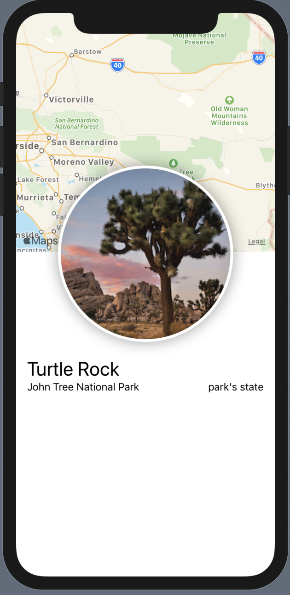

A Swift Tutorial from the official [Site](https://developer.apple.com/tutorials/swiftui/creating-and-combining-views)

## What i have learnt

- Creating Custom View
- Using Modifiers to update the look and feel of UI Items
- Creating Nested/Complex Views
- Using UIKit views within SwiftUI views

Here's a preview of the application 
